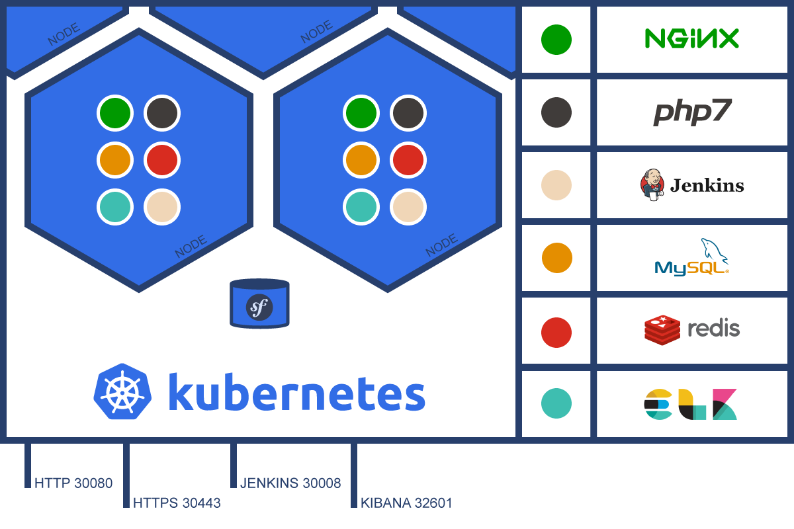

# Kubernetes for Symfony

[](LICENSE)
[](https://github.com/carlosas/kubernetes-for-symfony/issues)
[](README.md)



---

WARNING :warning: **This project is no longer maintained (for now)**

---

## Introduction

This stack is a starting point for building a distributed and scalable stack with Kubernetes. It runs locally with Minikube, but it can be modified to use AWS or GCE. Any contribution in this direction would be appreciated.

## Quick guide

### Requirements

* kubectl https://kubernetes.io/docs/tasks/tools/install-kubectl/
* minikube https://kubernetes.io/docs/tasks/tools/install-minikube/

### Usage

#### Build and start the stack:

* Define your passwords in *kubernetes/secrets.yaml*, encrypted in base64:

```sh
echo -n "MYPASSWORD" | base64
```

> For Jenkins encrypt: `--argumentsRealm.passwd.jenkins=MYPASSWORD --argumentsRealm.roles.jenkins=admin`

* Start the stack

```sh
./scripts/start-and-create.sh
```

* Create local persistent volumes

```sh
./scripts/create-persistent-volumes.sh
```

* Clone your repository into the stack *(set 'mysql' as database host)*

```sh
./scripts/clone-my-repository.sh
```

#### Clean up and stop the stack:

```sh
./scripts/stop-and-delete.sh
```
